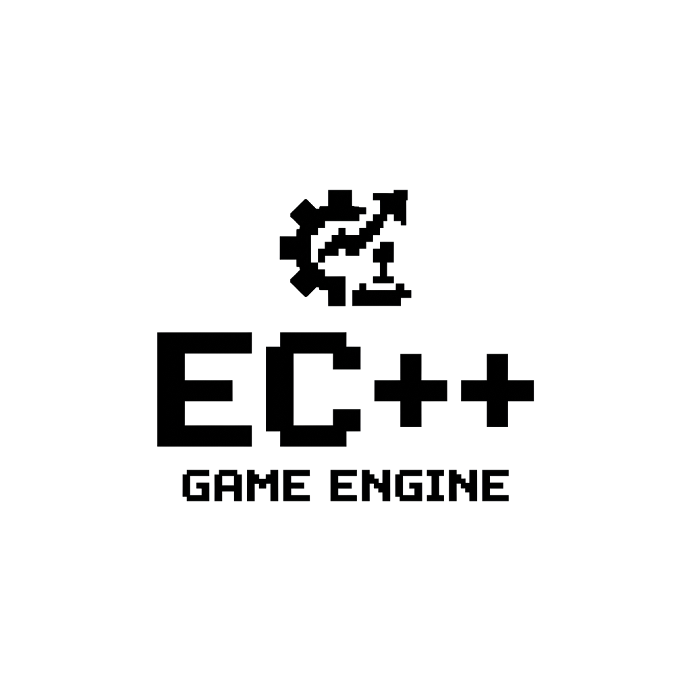

<p align="center">
  
</p>

<p align="center">
  
  
  
  
</p>

---

**EC++** is a blazingly fast, AAA-grade header-only Entity Component System (ECS) library written in pure C++17. More than just an ECS, it provides professional data-management tools for Game Engine development.

## 📖 Documentation

Want to dive deep into EC++? Check out our official documentation:

*   **[Getting Started Guide](docs/GettingStarted.md)** - Learn how to initialize the library and create your first entities.
*   **[Architecture Overview](docs/Architecture.md)** - Understand the power of Archetypes and how EC++ manages memory under the hood.
*   **[Advanced Engine Features](docs/AdvancedFeatures.md)** - Master V4 tools like Command Buffers, Custom Allocators, and Reflection.
*   **[API Reference](docs/API_Reference.md)** - Complete documentation of all public interfaces, classes, and macros.

---

## ✨ Key Features

*   **Archetype Storage**: Iterate over systems with zero cache-misses! Entities are perfectly packed in memory.
*   **System Dependency Graph**: Automatically resolves execution order using Topological Sorting.
*   **Entity Hierarchies (V6)**: Built-in `coord.AddChild()` tree architecture. Effortlessly attach weapons to players or build nested UI panels.
*   **JSON Serialization (V6)**: Save and Load entire game states directly to JSON using our zero-dependency `ecpp::Serializer`.
*   **Spatial Hashing & Culling**: Built-in 2D/3D `SpatialHash` grid to instantly query millions of entities and rapidly cull off-screen objects.
*   **Zero-Byte Tags**: Perform sparse iteration using empty components to perfectly pack "active" or "visible" entities into cache.
*   **Command Buffers**: Safely queue ECS mutations (Add/Remove Component, Create/Destroy Entity) across multiple threads during JobSystem execution.
*   **Custom Memory Allocators**: Prevent heap fragmentation using built-in `LinearAllocator` and `PoolAllocator`.
*   **Reflection & Editor Support**: Automatically expose C++ component data to your engine's UI Editor (e.g., ImGui) using our zero-dependency macro system.
*   **Header-Only & Cross-Platform**: No dependencies. Just drop the `include/ecpp/` directory into your project!

---

## 🕹️ How to Integrate into Your Game Engine

EC++ is intentionally designed **not** to take over your game loop or window management. It acts as a pure, high-performance data-management layer that seamlessly plugs into your existing architecture.

1. **The Game Loop**: Simply call `gCoordinator.UpdateSystems(dt);` inside your engine's existing Fixed Update or variable Update loop. EC++ doesn't force a specific tick rate on you.
2. **The Editor UI**: Read the `ecpp::ReflectionInfo<T>::GetFields()` arrays when rendering your ImGui or Qt Inspector windows. This allows your engine to automatically draw sliders and checkboxes without hardcoding UI for every component!
3. **The Physics/Render Threads**: If your engine uses a custom thread pool for Physics or Render passes, pass an `ecpp::CommandBuffer` into those worker threads. They can freely queue Entity destructions and creations, and your engine can safely call `cmdBuf.Execute()` back on the main thread when the threads sync.

---

## 🚀 Quick Look

Here is a glimpse of the powerful tools available in V4:

### Thread-Safe Command Buffers
When using a Job System across multiple threads, you cannot safely destroy entities. Use `CommandBuffer` to queue changes and execute them safely later.

```cpp
void DamageSystem::Update(ecpp::Coordinator& coord, ecpp::CommandBuffer& cmdBuf) {
    // ... inside a worker thread
    if (health.current <= 0) {
        cmdBuf.QueueDestroyEntity(entity);
    } else {
        cmdBuf.QueueRemoveComponent<Damage>(entity);
    }
}

// ... back on the main thread after jobs finish
cmdBuf.Execute(coord);
```

### C++ Reflection for Editor UIs
Want to build an Inspector UI for your engine? Just reflect your components.

```cpp
ECPP_REFLECT_BEGIN(Position)
    ECPP_REFLECT_FIELD(Position, x),
    ECPP_REFLECT_FIELD(Position, y)
ECPP_REFLECT_END()

// Later, automatically draw ImGui sliders dynamically:
for (const auto& field : ecpp::ReflectionInfo<Position>::GetFields()) {
    std::cout << field.name << " is of type " << field.typeName << "\n";
}
```

---

## 🛠️ Building & Running Examples

Since EC++ is a header-only library, you don't need to build the library itself. However, you can easily compile and run the provided examples using any modern C++17 compiler (like `g++`, `clang++`, or MSVC).

To run the **V4 Advanced Features Example** from your terminal:

```bash
# Compile the example
g++ -std=c++17 examples/v4_main.cpp -o v4_example

# Run the compiled executable
./v4_example
```

### Included Examples

*   **`examples/v4_main.cpp`** - A comprehensive showcase including Multithreaded Command Buffers, Pool Allocators, and the Reflection system.
*   **`examples/spaceship_benchmark.cpp`** - A classic performance benchmark simulating thousands of spaceships iterating through boundary and movement systems at blazing speeds.
*   **`examples/v6_serialization_hierarchy.cpp`** - Showcases creating parent/child entity relationships and saving the entire game state into a JSON file using zero-dependency reflection!
*   **`examples/v5_sparse_rendering.cpp`** - Showcases zero-byte tag culling by updating thousands of entities in a `SpatialHash` grid and rapidly rendering only the objects within the Camera's Viewport.
*   **`examples/editor_ui_mockup.cpp`** - Demonstrates how to use the EC++ Reflection system to build a dynamic "ImGui-style" Inspector window for any component.
